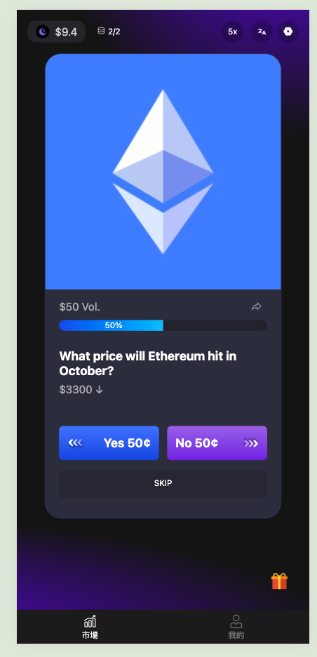
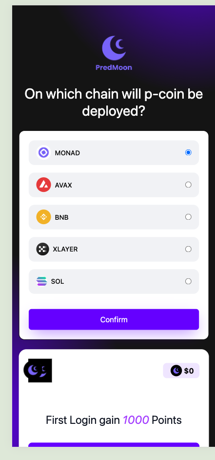

# [PredMoon] - Cypherpunk Hackathon 2025


## 1. Deliverables

- [x] GitHub Repository
- [x] [Deck](https://www.canva.com/design/DAG2PfMVKZM/lUOhxNw80bQNv4kbpQnQag/view?utm_content=DAG2PfMVKZM&utm_campaign=designshare&utm_medium=link2&utm_source=uniquelinks&utlId=hd0f28c489d)
- [x] Demo Video on youtube: https://youtu.be/RUZHgOvq8hk
- [x] Online Demo Link
  - Onchain version: https://Pred.WTF
  - Offchain version: https://Pred.WTF/t-1 (replace t-1 to t-2,3...17)
  - Pro version(the same UI as PolyMarket): https://pro.Pred.WTF
- [x] Contract Deployment Information

## 2. Team Information Section

### 1) Project Overview
- **deck**: https://www.popai.pro/ppt-share?shareKey=a056195425a5ba622c00b4db784aa2231ef5f49e5c439399886561ea1fa5e953&utm_source=presentationsharepage
- **Project Name**: PredMoon
- **One-line Description**: A prediction market platform that users could trade by their beliefs and knowledge
- **Target Users**: All crypto users
- **Core Problems & Motivation (Pain Points)**: Monetizing Beliefs and getting collective wisdom based on blockchain
- **Solution**: We developed PredMoon using a combination of smart contracts, Vue, Supabase, and Privy to let users trade their knowledge on-chain. The platform operates like Tinder: swiping left or right corresponds to a YES/NO transaction, and users can earn a profit.

### 2) Architecture & Implementation

- **Overview Diagram**: 


- **Key Modules**:
  - Frontend: Swipe trading system/Embedded wallet/Cross-chain transfer integration
  - Backend: Off-chain order matching/Hybrid decentralized exchange model
  - Contracts: Cross-chain bridge technology/Efficient transaction settlement/Decentralized security/Ecosystem compatibility
  - Others: Self-developed Large Language Model (LLM)
- **Dependencies & Tech Stack**:
  - Frontend: Vue/Nuxt.js, ethers.js, Tailwind CSS, Privy.js
  - Backend: Node.js, Supabase, PostgreSQL
  - Contracts: Rust
  - Deployment: Vercel, AWS


### 4) Run & Reproduce

- **Prerequisites**: Node 18+, pnpm, Git
- **Environment Variables Example**:


- **Quick Start (Local Example)**:

```bash
# Install dependencies
pnpm install

# Start backend
pnpm --filter backend dev

# Start frontend
pnpm --filter frontend dev

# Open http://localhost:3000
```

- **Online Demo**: [pred.wtf](https://pred.wtf)
- **Account & Testing Instructions**: register by your own email

### 5) Demo & Key Flows

- **Video Link (≤3 minutes, Chinese)**: https://youtu.be/RUZHgOvq8hk
- **Key Use Case Steps**:
  - Use Case 1: Login module with Privy (embedded wallet)
  - Use Case 2: Deposit through multi-chain
  - Use Case 3: Trade module

### 6) Verifiable Scope
Due to commercial application reasons, complete system code cannot be provided

### 7) Roadmap & Impact

- **1-3 Weeks Post-Competition**: Complete continuous optimization of pages and system performance, improve user experience and market stability.
- **1-3 Months Post-Competition**: Drive user growth through cold-start operations and community incentive programs;
  Conduct multiple marketing campaigns to enhance brand exposure and prediction market liquidity;
  Gradually launch PredSeed financing plan to provide funding support for subsequent product expansion and ecosystem construction.
- **Expected Value to Ethereum Ecosystem**: Become the first Chinese-language prediction market project in the Ethereum ecosystem, innovating user experience with unique style, and promoting diversified development of global prediction markets.

### 8) Team & Contacts

- **Team Name**: [Royal View Garden 8th Floor 10th Floor Swimming Pool Maintenance Team]
- **Members & Roles**:
  - Adam Ma – Founder
  Adam has extensive experience in both Web2 and Web3 entrepreneurship, as well as years of experience at major tech companies including 360, RC, and iHealth. He has won 20+ global hackathon awards and previously founded a sneaker marketplace with millions in transaction volume, as well as Web3 RWA projects. Notably, he has executed a user cold-start of 5,000+ users in a single day.
  - KK – Co-founder
  KK graduated from HKUST and brings extensive development experience, including years at Tsinghua Research Institute, combined with strong social and creative insight. He leads product design, social media, and brand strategy, and has deep experience with AI tools and innovative product ideation.
  - Ben – Co-founder
  Ben graduated from Shanghai University and has 9 years of solid front-end development experience. He previously worked at Citibank Singapore HQ, specializing in React and Vue development.
  - Other core team members
  Our team consists of 10+ talented professionals, covering development, design, community, and marketing. Together, we bring a balanced mix of technical expertise, creative vision, and operational experience to build PredMoon.
- **Contact Information (Email/TG/X)**: hello@pred.wtf

## Matching Scenarios

### Asset Definitions

* **`A`** - ERC1155 outcome token
* **`A'`** - ERC1155 complementary outcome token*
* **`C`** - ERC20 collateral token
* All examples assume `A` and `A'` are priced at 0.5 USDC each

*Note: Complementary relationship means 1 outcome token + 1 complementary token can be merged into 1 collateral token, and vice versa (i.e., **`A`** + **`A'`** = **`C`**). Assume outcome tokens and collateral tokens have the same decimal precision. Examples assume **`C`** is USDC.

### Scenario 1 - Minting Transaction

* user1 buys 100 `A`, transfers 50 `C` to exchange
* user2 buys 100 `A'`, transfers 50 `C` to exchange
* Exchange mints 100 `A` for user1, 100 `A'` for user2

```js
const takerOrder = {
    salt: randomId(),
    maker: user1,
    tokenId: 1, // Token ID for A'
    tokenAmount: 100 * 10**6,
    tokenPriceInPaymentToken: 0.5 * 10**6, // 0.5 USDC (could be 0 for market orders)
    paymentTokenAddress: '0xxxxx', // USDC address
    slippageBps: 100, // Allowed slippage (0 indicates limit order)
    deadline: 1672531200, // Expiration timestamp
    side: 1, // 1: buy, 2: sell
    feeTokenAddress: '', // Fee token address (USDC or company token)
    
    // Signature fields
    sig: 'xxxxx', // Frontend signature of above data
    
    // Off-chain calculated transaction details
    exchangeNftAmount: 100 * 10**6, // NFT amount maker will receive
    paymentTokenAmount: 100 * 10**6, // USDC amount maker must pay
    paymentTokenAddress: '0xxxxx', // Payment token address (USDC)
    
    // Dual fee fields for multi-token fee support
    fee1Amount: 123, // Primary fee amount
    fee1TokenAddress: '0xxxxx', // Primary fee token (USDC/company token)
    fee2Amount: 456, // Secondary fee amount
    fee2TokenAddress: '0xxxxx' // Secondary fee token (USDC/company token)
}

const makerOrders = [{
    salt: randomId(),
    maker: user2,
    tokenId: 2, // Token ID for A'
    tokenAmount: 100 * 10**6,
    tokenPriceInPaymentToken: 0.5 * 10**6,
    paymentTokenAddress: '0xxxxx',
    slippageBps: 100,
    deadline: 1672531200,
    side: 1,
    feeTokenAddress: '',
    sig: 'xxxxx',
    exchangeNftAmount: 100 * 10**6,
    paymentTokenAmount: 100 * 10**6,
    paymentTokenAddress: '0xxxxx',
    fee1Amount: 123,
    fee1TokenAddress: '0xxxxx',
    fee2Amount: 456,
    fee2TokenAddress: '0xxxxx'
}]

matchOrders(takerOrder, makerOrders)
```

### Scenario 2 - Regular Transaction

* user1 buys 100 `A`, transfers 50 `C` to exchange
* user2 sells 100 `A`, receives 50 `C` from exchange

### Scenario 3 - Merge Transaction

* user1 sells 100 `A`
* user2 sells 100 `A'`
* Exchange merges 100 `A` + 100 `A'` into 100 `C`
* Exchange transfers 50 `C` to user1
* Exchange transfers 50 `C` to user2

### Fee Mechanism

Fees are collected from output assets (proceeds). For complementary binary tokens (**`A`** + **`A'`** = **`C`**), fees must maintain symmetry to preserve market integrity. Symmetry means selling 100 `A` at $0.99 and buying 100 `A'` at $0.01 should incur equal fee value.

**Rules:**
- Buy operations (receiving **`A`**/**`A'`**) charge fees on output tokens
- Sell operations (receiving **`C`**) charge fees on collateral tokens

Base fee rate (`baseFeeRate`) is written into order structure, corresponding to 2x fee rate when tokens are equally priced ($0.50/$0.50). Price deviations use formula:

`USDC fee = baseFeeRate * min(price, 1-price) * token quantity`

*Example 1:*
- price = 0.2
- feeBps = 100
- fee = 0.01 * min(0.2, 0.8) * 100 = 0.2

*Example 2:*
- Selling 100 `A` at $0.99:  
  0.01 * min(0.99, 0.01) * 100 = 0.01 (deduct 0.01 `C` as fee)
- Buying 100 `A'` at $0.01:  
  0.01 * min(0.01, 0.99) * 100 = 0.01 (deduct 1 `A'` as fee)

## Screenshots
  
  
  

